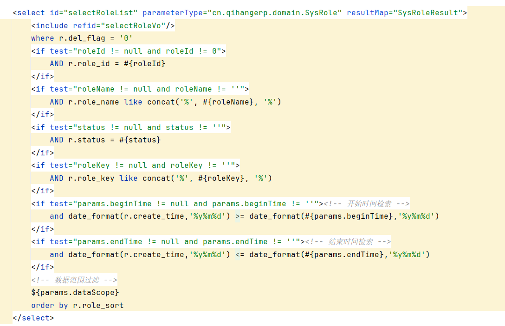

## [qihangerp-cloud](https://github.com/zeasin/qihangerp-cloud)  has a backend SQL injection vulnerability

There is SQL injection when ${params.dataScope} is used in multiple places in the mybatis configuration file:



Classes & Methods：SysRoleController#list

Path：/system/role/list

Directly query the incoming parameters：


Time Blind Injection Test：

```
?pageNum=1&pageSize=10&status=0&params[dataScope]=AND+(select+sleep(5))--+
```


Test successful ! 

